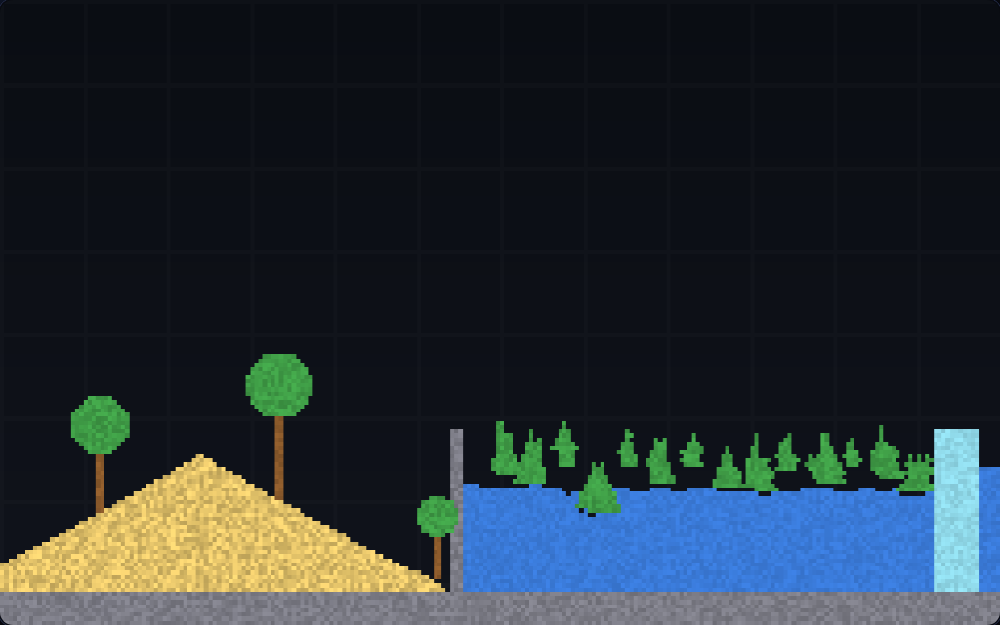
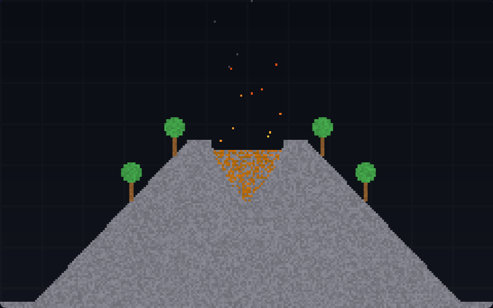
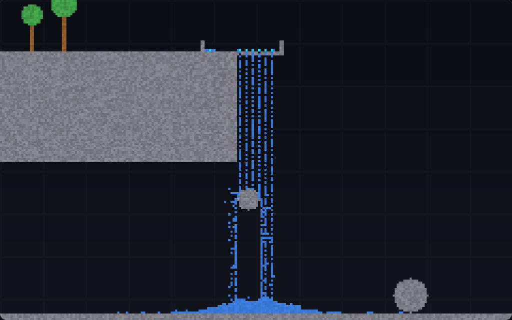

# 元素沙盒 · Falling Sand

一个**打开就能玩**的网页物理沙盒：拿笔刷往画布上撒沙子、倒水、点火，元素之间会自己反应——
沙子堆成 45° 斜坡、水自己找平、油浮在水面上、火顺着木头和油烧过来、种子掉进水里长成藤蔓、
岩浆碰水变成石头并冒蒸汽、酸液把石头啃出洞、水源造出流不完的瀑布。

零依赖、零素材、零构建：没有图片、没有音频、没有 CDN。MIT 许可，26 项自动化测试全绿。



## 怎么玩

```bash
git clone https://github.com/Ceresrrr/element-sandbox.git
```

**双击 `index.html`** 就行——不需要起服务器，不需要 `npm install`。脚本特意用经典 `<script>`
而不是 ES module，就是为了让 `file://` 直接打开也能跑（ES module 在 file:// 下会被 CORS 拦掉）。

| 操作 | 效果 |
| --- | --- |
| 按住拖动 | 涂抹当前元素 |
| 右键拖动 / Shift + 拖动 | 擦除 |
| 滚轮 | 调笔刷大小 |
| 空格 | 暂停 / 继续 |
| `.` | 单步一帧 |
| `C` | 清空 |
| `1`–`9` `0` `Q` `W` `E` `R` `T` | 依次切换 15 种元素 |
| 侧栏「场景」 | 一键铺 山谷 / 沙漏 / 火山 / 瀑布 / 森林 / 冰与火 |
| 侧栏「天气」 | 下小雨、暴雨或酸雨（持续从顶部落水滴 / 酸液） |
| 侧栏「速度」 | 1× / 2× / 3× 模拟速度，1× 大约 60 帧/秒 |

## 元素一览

| 元素 | 类别 | 行为 |
| --- | --- | --- |
| 沙子 | 粉末 | 下落、堆成 45° 斜坡、能沉进水里 |
| 水 | 液体 | 流动找平、浇灭火、被岩浆汽化 |
| 油 | 液体 | 密度比水小所以浮在水面上，极易燃 |
| 火 | 气体 | 点燃可燃物、遇水熄灭变蒸汽、寿命到了变烟 |
| 石头 | 固体 | 不动的墙，会被酸腐蚀 |
| 木头 | 固体 | 可燃，烧得慢 |
| 冰 | 固体 | 碰到火或岩浆化成水 |
| 岩浆 | 液体 | 点燃一切、把水变蒸汽、自己冷却成石头 |
| 酸液 | 液体 | 腐蚀石头/木头/植物/冰/沙，自身会耗尽 |
| 植物 | 固体 | 种子遇水长成，顺着水往上爬，可燃 |
| 种子 | 粉末 | 碰到水就发芽 |
| 蒸汽 | 气体 | 上升，冷却后凝回水 |
| 烟 | 气体 | 上升后消散 |
| 水源 | 固体 | 不会动的出水口：下面空了就往出冒水，水位漫过它就自动停手 |
| 橡皮 | — | 擦除 |




## 工程结构

```
element-sandbox/
├─ index.html          页面骨架（4 个经典脚本按顺序加载）
├─ css/style.css       暗色 UI、窄屏自适应
├─ js/elements.js      元素定义表：颜色、类别、密度、可燃性、寿命
├─ js/sim.js           物理引擎（不碰 DOM，可在 Node 里直接 require）
├─ js/presets.js       预设场景，全部按比例生成，换分辨率不走形
├─ js/main.js          渲染（ImageData + 整数倍放大）、输入、UI 装配
├─ preview/            预览图
└─ test/               引擎行为测试 + 交付物自检
```

## 跑测试

```bash
node --test                    # 全部 26 条
node --test test/sim.test.js   # 只测物理引擎
```

`test/sim.test.js` 用固定 seed 构造世界，逐条断言物理行为：沙子落底并在底部铺开、沙堆不悬空、
水找平且总量守恒、油浮在水上、火点燃油并蔓延、水浇灭火并产生蒸汽、蒸汽必然冷凝、
种子遇水长成植物并向上生长、酸腐蚀石头、岩浆遇水成石、水不穿石头地面、水源持续出水且会自己停、
水不会停在半空、同 seed 逐格一致、画笔半径与边界、六个场景可生成、以及 150 帧的性能烟测。

`test/assets.test.js` 检查交付物本身：`index.html` 引用的文件都存在、没有任何外部 URL、
没有 ESM 语法（保证 `file://` 可开）、`main.js` 取的 DOM id 都真的存在、README 写明了玩法。

## 引擎设计要点

几个踩过坑才定下来的决定：

- **一遍扫描干不了反应**。最初反应和位移在同一遍里跑，结果油一流动就把火焰"顶"走，
  被 `swap` 标记成"本帧已处理"，火焰那一帧的反应被整个跳过——油永远点不着（实测 48 格油烧了 1 格）。
  现在拆成**第一遍只跑反应、第二遍只跑位移**，`moved` 标记只影响位移。
- **液体不许挤开火焰**。火焰是"反应区"不是气泡；否则油流一下就把火挤到空中。
  （蒸汽、烟仍然可以被液体挤开。）
- **火焰大部分帧原地舔舐燃料**，只小概率往上窜，不然一帧就飘走，来不及点燃东西。
- **水源的出水口要放在悬空处**。第一版把水源泡在湖里，下面和左右都是水，它就被自己的水堵死，
  实测只有 0.28 格/帧，瀑布是一串虚线。改成"石渠 + 一排悬空出水口"，每个口子下面都是空气，
  出水速度立刻变成 2–3.5 格/帧，水柱才连成片。
- **确定性随机数**（mulberry32）：同一个 seed 逐格复现，测试才能稳定断言。
  注意测试里取坐标不能借用被测世界的 `rng()`，否则那个世界会多走几步随机数、两边就不同步了。
- **边界外一律当石头**，所以四周天然是墙，粒子不会漏出去。
- 网格用并列 TypedArray（`cells` / `shade` / `data` / `moved`），渲染时整块写进 `ImageData`，
  再整数倍放大（`imageSmoothingEnabled = false`），所以放大后是硬朗的像素感。
- 物理与渲染分辨率固定在 240×150，画布只是显示大小；窗口怎么缩放，模拟结果都一样。
- 只用浏览器原生能力：Canvas 2D + `ImageData` + `requestAnimationFrame`，不依赖任何框架或库。

## 许可证

[MIT](LICENSE) © 2026 Ceresrrr
